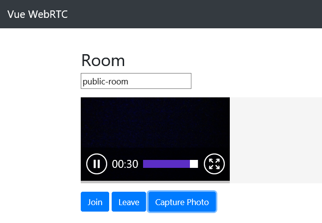

# vue-webrtc

WebRTC component designed for Vue.js ... See the [DEMO](https://westonsoftware.github.io/vue-webrtc/)

<p align="center">
    
</p>

[](https://www.npmjs.com/package/vue-webrtc)
[](https://www.npmjs.com/package/vue-webrtc)

[](https://opensource.org/licenses/MIT)

See [this](http://caniuse.com/#feat=stream)
for browser compatibility.


## Installation

```
npm install vue-webrtc --save

yarn add vue-webrtc
```

## Usage

```javascript
import Vue from 'vue'
import WebRTC from 'vue-webrtc'

Vue.use(WebRTC)
// or
import {WebRTC} from 'vue-webrtc'
Vue.component(WebRTC.name, WebRTC)

// template
<vue-webrtc width="100%" roomId="roomId">
</vue-webrtc>
```

## Testing & Dev

```
npm run dev
npm run demo
```

### Props

| prop             | type    | default      | notes                     |
| ---------------- | ------- | ------------ | ------------------------- |
| roomId           | string  | 'public-room' | id of the room to join   |
| socketURL        | string  | '' | URL of the signaling server   |
| cameraHeight     | number  | 160          | height of video element   |
| autoplay         | boolean | true         | autoplay attribute        |
| screenshotFormat | string  | 'image/jpeg' | format of screenshot      |
| enableAudio      | boolean  | true | enables audio on join      |
| enableVideo      | boolean  | true | enables video on join      |
| enableLogs       | boolean  | false | enables webrtc console logs    |

### Events

| name           | param    | notes                                                         |
| -------------- | -------- | ------------------------------------------------------------- |
| opened-room    | roomid   | emitted when the first user opens the room                    |
| joined-room    | video    | emitted when anyone joins the room                            |
| left-room      | video.id | emitted when anyone leaves the room                           |
| share-started  | video.id | emitted when a local screen share stream starts               |
| share-stopped  | video.id | emitted when a local screen share stream stops                |

### Methods

| name           | param    | notes                                                                   |
| -------------- | -------- | ----------------------------------------------------------------------- |
| join           | void     | Join a room, opening it if needed                                       |
| leave          | void     | Leave a room                                                            |
| capture        | void     | Capture the current image through the webcam as base64 encoded string   |
| shareScreen    | void     | Share your screen or an app as video   |

### Styles

.video-list

.video-item

## History

| Version           | Notes                                                                   |
| -------------- | ----------------------------------------------------------------------- |
| 1.2.1           | Added Vue CLI sample, npm audit fixes                                       |
| 1.2.0           | Added the Screen Share button                                       |

## Quick Start with Vue CLI
```
vue create sample
cd sample
yarn install
npm install vue-webrtc --save
```
Now open the App.vue file and add the code in the Usage section above.
```
npm run serve
```
See the /sample folder

## Roadmap
There are many more features provided by the RTCMultiConnection library that we'd like to support, including:
- Camera selection (we currently use the default camera)
- Audio selection
- WebRTC data events

Let us know what you'd like to see next and vote for a feature.

## License

MIT


## Credits

Author: [@AndyWeston on GitHub at vue-webrtc](https://github.com/westonsoftware)

This project is based off of the excellent work found at WebRTC Experiments:
https://www.rtcmulticonnection.org/


The Vue.js work is based on this camera component:  
[@vinceg vue-web-cam](https://github.com/vinceg/vue-web-cam)


